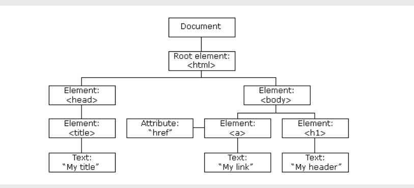

# Module 1 HTML CSS JS COMBO

## 1. The HTML DOM (Document Object Model)

When a web page is loaded, the browser creates a Document Object Model of the page.

The HTML DOM model is constructed as a tree of Objects:



With the object model, JavaScript gets all the power it needs to create dynamic HTML:

- JavaScript can change all the HTML elements in the page
- JavaScript can change all the HTML attributes in the page
- JavaScript can change all the CSS styles in the page
- JavaScript can remove existing HTML elements and attributes
- JavaScript can add new HTML elements and attributes
- JavaScript can react to all existing HTML events in the page
- JavaScript can create new HTML events in the page

> The HTML DOM is a standard object model and programming interface for HTML. It defines:

The HTML elements as objects
The properties of all HTML elements
The methods to access all HTML elements
The events for all HTML elements

### The getElementById Method

The most common way to access an HTML element is to use the id of the element.

In the example below the getElementById method used id="demo" to find the element.

```bash
        <html>
        <body>

        <p id="demo"></p>

        <script>
        document.getElementById("demo").innerHTML = "Hello World!";
        </script>

        </body>
        </html>

```

### The innerHTML Property

The easiest way to get the content of an element is by using the innerHTML property.

The innerHTML property is useful for getting or replacing the content of HTML elements.

### Changing HTML Content

```bash
       <html>
        <body>

        <p id="p1">Hello World!</p>

        <script>
        document.getElementById("p1").innerHTML = "New text!";
        </script>

        </body>
        </html>

```

### Changing the Value of an Attribute
To change the value of an HTML attribute, use this syntax:

document.getElementById(id).attribute = new value
```bash
        <!DOCTYPE html>
        <html>
        <body>

        

        <script>
        document.getElementById("myImage").src = "landscape.jpg";
        </script>

        </body>
        </html>
```

### The addEventListener() method

- The addEventListener() method attaches an event handler to the specified element.

- The addEventListener() method attaches an event handler to an element without overwriting existing event handlers.

- You can add many event handlers to one element.

- You can add many event handlers of the same type to one element, i.e two "click" events.

- You can add event listeners to any DOM object not only HTML elements. i.e the window object.

- The addEventListener() method makes it easier to control how the event reacts to bubbling.

- When using the addEventListener() method, the JavaScript is separated from the HTML markup, for better readability and allows you to add event listeners even when you do not control the HTML markup.

### The HTMLCollection Object
The getElementsByTagName() method returns an HTMLCollection object.

An HTMLCollection object is an array-like list (collection) of HTML elements.

The following code selects all <p> elements in a document:

Example
const myCollection = document.getElementsByTagName("p");
The elements in the collection can be accessed by an index number.

To access the second <p> element you can write:

myCollection[1]

> An HTMLCollection is NOT an array!

An HTMLCollection may look like an array, but it is not.

You can loop through the list and refer to the elements with a number (just like an array).

However, you cannot use array methods like valueOf(), pop(), push(), or join() on an HTMLCollection.

### The HTML DOM NodeList Object
A NodeList object is a list (collection) of nodes extracted from a document.

A NodeList object is almost the same as an HTMLCollection object.

Some (older) browsers return a NodeList object instead of an HTMLCollection for methods like getElementsByClassName().

All browsers return a NodeList object for the property childNodes. 

Most browsers return a NodeList object for the method querySelectorAll().

The following code selects all <p> nodes in a document

### The Difference Between an HTMLCollection and a NodeList
An HTMLCollection is a collection of document elements.

A NodeList is a collection of document nodes (element nodes, attribute nodes, and text nodes).

HTMLCollection items can be accessed by their name, id, or index number.

NodeList items can only be accessed by their index number.

html file
```bash
        <!DOCTYPE html>
        <html lang="en">
        <head>
        <meta charset="UTF-8">
        <meta name="viewport" content="width=device-width, initial-scale=1.0">
        <title>NodeList vs HTMLCollection</title>
        </head>
        <body>
        <div class="container">
                <p id="para1">Paragraph 1</p>
                <p id="para2">Paragraph 2</p>
                <span id="span1">Span 1</span>
                <span id="span2">Span 2</span>
        </div>
        <script src="script.js"></script>
        </body>
        </html>

```

script.js file
```bash
        // Accessing elements using HTMLCollection
        const paragraphs = document.getElementsByTagName('p'); // Returns an HTMLCollection
        console.log('Accessing HTMLCollection:');
        console.log(paragraphs); // Logs the entire collection

        // Accessing by index
        console.log('Accessing by index:');
        console.log(paragraphs[0].innerText); // "Paragraph 1"
        console.log(paragraphs[1].innerText); // "Paragraph 2"

        // Accessing by ID (not possible directly, but we can use a method)
        console.log('Accessing by ID:');
        console.log(document.getElementById('para1').innerText); // "Paragraph 1"

        // Accessing elements using NodeList
        const allElements = document.querySelectorAll('.container *'); // Returns a NodeList
        console.log('Accessing NodeList:');
        console.log(allElements); // Logs the entire NodeList

        // Accessing by index
        console.log('Accessing by index:');
        console.log(allElements[0].innerText); // "Paragraph 1"
        console.log(allElements[1].innerText); // "Paragraph 2"
        console.log(allElements[2].innerText); // "Span 1"
        console.log(allElements[3].innerText); // "Span 2"

        // Trying to access by name or ID (not applicable for NodeList)
        try {
        console.log(allElements['para1'].innerText); // This will be undefined
        } catch (error) {
        console.log('Error accessing by ID or name in NodeList:', error.message);
        }

```


1 Change Text Content:
Create a button that, when clicked, changes the text content of a <p> tag or a heading.

2 Change CSS Styles:
Create a button that, when clicked, changes the background color or font size of a div or text.

3 Create Elements Dynamically:
Have students create a to-do list where they can add new list items dynamically using JavaScript.

4. Delete Elements Dynamically:
Modify the to-do list to include a delete button for each item that removes the item from the list.

5. Toggle Visibility:
Create a button that toggles the visibility of a div or image when clicked.