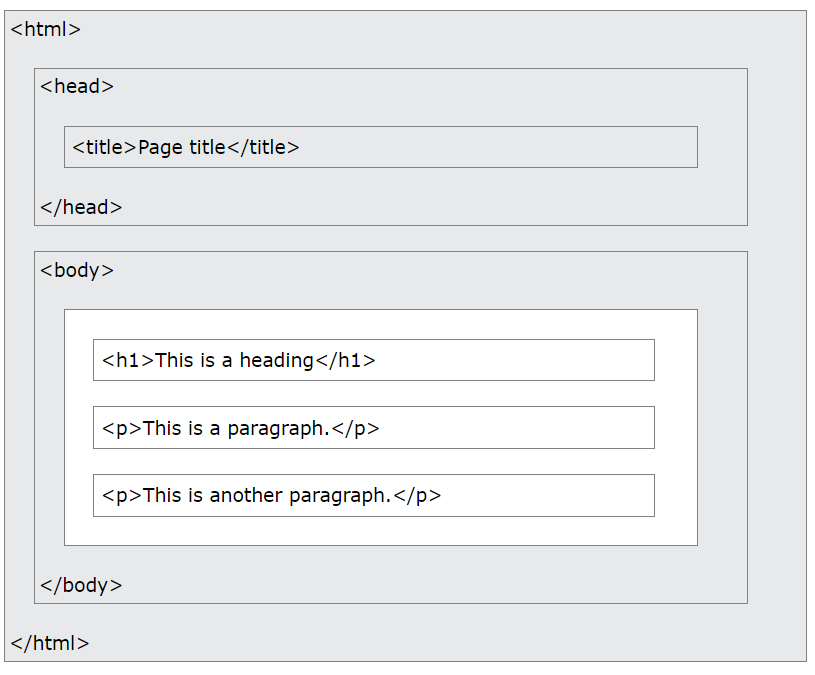

# MODULE 1 HTML

## 1. What is HTML?

HTML (HyperText Markup Language) is

- the standard language for creating web pages.
- used to create the structure of a webpage

```bash
    <!DOCTYPE html>
    <html>
    <head>
        <title>My First Webpage</title>
    </head>
    <body>
        <h1>Welcome to My Webpage</h1>
        <p>This is a paragraph of text.</p>
    </body>
    </html>
```

Example Explained

- The <!DOCTYPE html> declaration defines that this document is an HTML5 document
- The <html> element is the root element of an HTML page
- The <head> element contains meta information about the HTML page
- The <title> element specifies a title for the HTML page (which is shown in the browser's title bar or in the page's tab)
- The <body> element defines the document's body, and is a container for all the visible contents, such as headings, paragraphs, images, hyperlinks, tables, lists, etc.
- The <h1> element defines a large heading
- The <p> element defines a paragraph

## 2. What is an HTML Element?

An HTML element is defined by a start tag, some content, and an end tag

```bash
    <tagname> Content goes here... </tagname>
```

The HTML element is everything from the start tag to the end tag

```bash
    <h1>My First Heading</h1>
    <p>My first paragraph.</p>
```

## 3. Web Browsers

The purpose of a web browser (Chrome, Edge, Firefox, Safari) is to read HTML documents and display them correctly.

A browser does not display the HTML tags, but uses them to determine how to display the document

```bash
    <!DOCTYPE html>
    <html>
    <head>
        <title>My First Webpage</title>
    </head>
    <body>
        <h1>Welcome to My Webpage</h1>
        <p>This is a paragraph of text.</p>
    </body>
    </html>
```

## 4. HTML Page Structure

Below is a visualization of an HTML page structure

HTML (HyperText Markup Language) is

- the standard language for creating web pages.
- used to create the structure of a webpage



## 5. HTML Documents

All HTML documents must start with a document type declaration: <!DOCTYPE html>.

The HTML document itself begins with <html> and ends with </html>.

The visible part of the HTML document is between <body> and </body>

```bash
    <!DOCTYPE html>
    <html>
    <body>

    <h1>My First Heading</h1>
    <p>My first paragraph.</p>

    </body>
    </html>
```

## 6. HTML Headings

HTML headings are defined with the <h1> to <h6> tags.

<h1> defines the most important heading. <h6> defines the least important heading

```bash
    <h1>This is heading 1</h1>
    <h2>This is heading 2</h2>
    <h3>This is heading 3</h3>
```

## 7. HTML Paragraphs

HTML paragraphs are defined with the <p> tag

HTML (HyperText Markup Language) is

- the standard language for creating web pages.
- used to create the structure of a webpage

```bash
    <p>This is a paragraph.</p>
    <p>This is another paragraph.</p>
```

## 8. HTML Links

HTML links are defined with the <a> tag

```bash
    <a href="https://www.w3schools.com">This is a link</a>
```

The link's destination is specified in the href attribute.

Attributes are used to provide additional information about HTML elements.

## 9. HTML Images

HTML images are defined with the  tag.

The source file (src), alternative text (alt), width, and height are provided as attributes

```bash
    
```

## 10. Nested HTML Elements

HTML elements can be nested (this means that elements can contain other elements).

All HTML documents consist of nested HTML elements.

```bash
    <!DOCTYPE html>
    <html>
    <head>
        <title>My First Webpage</title>
    </head>
    <body>
        <main>
            <h1>Welcome to My Webpage</h1>
            <p>This is a paragraph of text.</p>
            <div>
                <span>some text.</span>
                <div>
                    Some elements to be displayed here...
                </div>
            </div>
        </main>
    </body>
    </html>
```

## 11. Never Skip the End Tag

HTML (HyperText Markup Language) is

- the standard language for creating web pages.
- used to create the structure of a webpage

```bash
   <html>
    <body>

    <p>This is a paragraph
    <p>This is a paragraph

    </body>
    </html>
```

> Note: "However, never rely on this! Unexpected results and errors may occur if you forget the end tag!"

## 12. HTML is Not Case Sensitive

HTML tags are not case sensitive: <P> means the same as <p>.

The HTML standard does not require lowercase tags, but W3C recommends lowercase in HTML, and demands lowercase for stricter document types like XHTML.

```bash
    <!DOCTYPE html>
    <html>
    <head>
        <title>My First Webpage</title>
    </head>
    <body>
        <h1>Welcome to My Webpage</h1>
        <p>This is a paragraph of text.</p>
        <P>This is a paragraph of text.</P>
    </body>
    </html>
```

## 13. HTML Attributes

- All HTML elements can have attributes
- Attributes provide additional information about elements
- Attributes are always specified in the start tag
- Attributes usually come in name/value pairs like: name="value"

### 13 (a). href attribute

The <a> tag defines a hyperlink. The href attribute specifies the URL of the page the link goes to

```bash
   <a href="https://www.youtube.com">Visit youtube</a>
```

### 13 (b). The src Attribute

The  tag is used to embed an image in an HTML page. The src attribute specifies the path to the image to be displayed

```bash
    
```

1. Absolute URL - Links to an external image that is hosted on another website. Example: src="https://www.website-url.com/images/img_girl.jpg".

Notes: External images might be under copyright. If you do not get permission to use it, you may be in violation of copyright laws. In addition, you cannot control external images; it can suddenly be removed or changed.

2. Relative URL - Links to an image that is hosted within the website. Here, the URL does not include the domain name. If the URL begins without a slash, it will be relative to the current page. Example: src="img_girl.jpg". If the URL begins with a slash, it will be relative to the domain. Example: src="/images/img_girl.jpg".

### 13 (c). The width and height Attributes

The  tag should also contain the width and height attributes, which specify the width and height of the image (in pixels)

```bash
   
```

### 13 (d). The alt Attribute

The required alt attribute for the  tag specifies an alternate text for an image, if the image for some reason cannot be displayed. This can be due to a slow connection, or an error in the src attribute, or if the user uses a screen reader.

```bash
   
```

### 13 (e). The style Attribute

The style attribute is used to add styles to an element, such as color, font, size, and more.

```bash
  <p style="color:red;">This is a red paragraph.</p>
```

### 13 (f). The title Attribute

The title attribute defines some extra information about an element.

The value of the title attribute will be displayed as a tooltip when you mouse over the element

```bash
   <p title="I'm a tooltip">This is a paragraph.</p>
```

```bash
    <!DOCTYPE html>
    <html>
    <head>
        <title>My First Webpage</title>
    </head>
    <body>
        <h1>Welcome to My Webpage</h1>
        <p>This is a paragraph of text.</p>
    </body>
    </html>
```

## 14. HTML Links - Hyperlinks

HTML links are hyperlinks.

You can click on a link and jump to another document.

When you move the mouse over a link, the mouse arrow will turn into a little hand.

> Note: A link does not have to be text. A link can be an image or any other HTML element!

```bash
    <!DOCTYPE html>
    <html>
    <head>
        <title>My First Webpage</title>
    </head>
    <body>
        <a href="url">link text</a>
        <a href="https://www.youtube.com/">Visit Youtube.com!</a>
        <P>This is a paragraph of text.</P>
    </body>
    </html>
```

HTML Links - The target Attribute
By default, the linked page will be displayed in the current browser window. To change this, you must specify another target for the link.

The target attribute specifies where to open the linked document.

The target attribute can have one of the following values:

- \_self - Default. Opens the document in the same window/tab as it was clicked
- \_blank - Opens the document in a new window or tab
- \_parent - Opens the document in the parent frame
- \_top - Opens the document in the full body of the window

## 15. Absolute URLs vs. Relative URLs

Absolute URL (a full web address) in the href attribute.

A local link (a link to a page within the same website) is specified with a relative URL (without the "https://www" part)

```bash
    <!DOCTYPE html>
    <html>
    <head>
        <title>My First Webpage</title>
    </head>
    <body>
        <h2>Absolute URLs</h2>
        <p><a href="https://www.w3.org/">W3C</a></p>
        <p><a href="https://www.google.com/">Google</a></p>

        <h2>Relative URLs</h2>
        <p><a href="html_images.asp">HTML Images</a></p>
        <p><a href="/css/default.asp">CSS Tutorial</a></p>
    </body>
    </html>
```

## 16. HTML Tables

HTML tables allow web developers to arrange data into rows and columns.

```bash
    <table>
        <tr>
            <th>Company</th>
            <th>Contact</th>
            <th>Country</th>
        </tr>
        <tr>
            <td>Alfreds Futterkiste</td>
            <td>Maria Anders</td>
            <td>Germany</td>
        </tr>
        <tr>
            <td>Centro comercial Moctezuma</td>
            <td>Francisco Chang</td>
            <td>Mexico</td>
        </tr>
    </table>
```

### 16 (a). Table Cells

Each table cell is defined by a <td> and a </td> tag.

td stands for table data.

```bash
    <table>
    <tr>
        <td>Emil</td>
        <td>Tobias</td>
        <td>Linus</td>
    </tr>
    </table>
```

### 16 (b). Table Rows

Each table row starts with a <tr> and ends with a </tr> tag.

tr stands for table row.

```bash
    <table>
    <tr>
        <td>Emil</td>
        <td>Tobias</td>
        <td>Linus</td>
    </tr>
    <tr>
        <td>16</td>
        <td>14</td>
        <td>10</td>
    </tr>
    </table>
```

### 16 (c). Table Headers

Sometimes you want your cells to be table header cells. In those cases use the <th> tag instead of the <td> tag:

th stands for table header

```bash
    <table>
    <tr>
        <th>Person 1</th>
        <th>Person 2</th>
        <th>Person 3</th>
    </tr>
    <tr>
        <td>Emil</td>
        <td>Tobias</td>
        <td>Linus</td>
    </tr>
    <tr>
        <td>16</td>
        <td>14</td>
        <td>10</td>
    </tr>
    </table>
```

## 17. HTML Lists

HTML tags are not case sensitive: <P> means the same as <p>.

The HTML standard does not require lowercase tags, but W3C recommends lowercase in HTML, and demands lowercase for stricter document types like XHTML.

```bash
    <!DOCTYPE html>
    <html>
    <head>
        <title>My First Webpage</title>
    </head>
    <body>
        <h1>Welcome to My Webpage</h1>
        <p>This is a paragraph of text.</p>
        <P>This is a paragraph of text.</P>
    </body>
    </html>
```

### 17 (a). Unordered HTML List

An unordered list starts with the <ul> tag. Each list item starts with the <li> tag.

The list items will be marked with bullets (small black circles) by default:

```bash
    <ul>
    <li>Coffee</li>
    <li>Tea</li>
    <li>Milk</li>
    </ul>
```

### 17 (b). Ordered HTML List

An ordered list starts with the <ol> tag. Each list item starts with the <li> tag.

The list items will be marked with numbers by default:

```bash
    <ol>
    <li>Coffee</li>
    <li>Tea</li>
    <li>Milk</li>
    </ol>
```

## 18. HTML Block and Inline Elements

Every HTML element has a default display value, depending on what type of element it is.

The two most common display values are block and inline.

### 18(a). Block-level Elements

A block-level element always starts on a new line, and the browsers automatically add some space (a margin) before and after the element.

A block-level element always takes up the full width available (stretches out to the left and right as far as it can).

Two commonly used block elements are: <p> and <div>.

The <p> element defines a paragraph in an HTML document.

The <div> element defines a division or a section in an HTML document.

```bash
    <p>Hello World</p>
    <div>Hello World</div>
```

Here are the block-level elements in HTML:

```bash
    <address><article><aside><blockquote><canvas><dd><div><dl><dt><fieldset><figcaption><figure><footer><form><h1>-<h6><header><hr><li><main><nav><noscript><ol><p><pre><section><table><tfoot><ul><video>
```

### 18(b). Inline Elements
An inline element does not start on a new line.

An inline element only takes up as much width as necessary.

This is a <span> element inside a paragraph.

```bash
    <span>Hello World</span>
```

Here are the inline elements in HTML:

```bash
    <a><abbr><acronym><b><bdo><big><br><button><cite><code><dfn><em><i><input><kbd><label><map><object><output><q><samp><script><select><small><span><strong><sub><sup><textarea><time><tt><var>
```

## 19. The <div> Element
The <div> element is often used as a container for other HTML elements.

The <div> element has no required attributes, but style, class and id are common.

When used together with CSS, the <div> element can be used to style blocks of content:

```bash
    <div style="background-color:black;color:white;padding:20px;">
    <h2>London</h2>
    <p>London is the capital city of England. It is the most populous city in the United Kingdom, with a metropolitan area of over 13 million inhabitants.</p>
    </div>
```

## 20. The <span> Element
The <span> element is an inline container used to mark up a part of a text, or a part of a document.

The <span> element has no required attributes, but style, class and id are common.

When used together with CSS, the <span> element can be used to style parts of the text:

```bash
    <p>My mother has <span style="color:blue;font-weight:bold;">blue</span> eyes and my father has <span style="color:darkolivegreen;font-weight:bold;">dark green</span> eyes.</p>
```

## 21. HTML Forms

An HTML form is used to collect user input. The user input is most often sent to a server for processing.

### 21(a). The <form> Element
The HTML <form> element is used to create an HTML form for user input

```bash
    <form>
    .
    form elements
    .
    </form>
```

The <form> element is a container for different types of input elements, such as: text fields, checkboxes, radio buttons, submit buttons, etc.

### 21(b). The <input> Element
The HTML <input> element is the most used form element.

An <input> element can be displayed in many ways, depending on the type attribute.

### 21(c). Text Fields
The <input type="text"> defines a single-line input field for text input.
```bash
    <form>
    <label for="fname">First name:</label><br>
    <input type="text" id="fname" name="fname"><br>
    <label for="lname">Last name:</label><br>
    <input type="text" id="lname" name="lname">
    </form>
```

> Note: The form itself is not visible. Also note that the default width of an input field is 20 characters.

### 21(d). The <label> Element
Notice the use of the <label> element in the example above.

- The <label> tag defines a label for many form elements.

- The <label> element is useful for screen-reader users, because the screen-reader will read out loud the label when the user focuses on the input element.

- The <label> element also helps users who have difficulty clicking on very small regions (such as radio buttons or checkboxes) - because when the user clicks the text within the <label> element, it toggles the radio button/checkbox.

- The for attribute of the <label> tag should be equal to the id attribute of the <input> element to bind them together.


### 21(e). Radio Buttons
The <input type="radio"> defines a radio button.

Radio buttons let a user select ONE of a limited number of choices.

```bash
    <p>Choose your favorite Web language:</p>

    <form>
    <input type="radio" id="html" name="fav_language" value="HTML">
    <label for="html">HTML</label><br>
    <input type="radio" id="css" name="fav_language" value="CSS">
    <label for="css">CSS</label><br>
    <input type="radio" id="javascript" name="fav_language" value="JavaScript">
    <label for="javascript">JavaScript</label>
    </form>
```

### 21(f). Checkboxes
The <input type="checkbox"> defines a checkbox.

Checkboxes let a user select ZERO or MORE options of a limited number of choices.

```bash
    <form>
        <input type="checkbox" id="vehicle1" name="vehicle1" value="Bike">
        <label for="vehicle1"> I have a bike</label><br>
        <input type="checkbox" id="vehicle2" name="vehicle2" value="Car">
        <label for="vehicle2"> I have a car</label><br>
        <input type="checkbox" id="vehicle3" name="vehicle3" value="Boat">
        <label for="vehicle3"> I have a boat</label>
    </form>
```

### 21(g). The Submit Button
The <input type="submit"> defines a button for submitting the form data to a form-handler.

The form-handler is typically a file on the server with a script for processing input data.

The form-handler is specified in the form's action attribute.

```bash
    <form action="/action_page.php">
    <label for="fname">First name:</label><br>
    <input type="text" id="fname" name="fname" value="John"><br>
    <label for="lname">Last name:</label><br>
    <input type="text" id="lname" name="lname" value="Doe"><br><br>
    <input type="submit" value="Submit">
    </form>
```

### 21(h). The Name Attribute for <input>
Notice that each input field must have a name attribute to be submitted.

If the name attribute is omitted, the value of the input field will not be sent at all.

```bash
    <form action="/action_page.php">
        <label for="fname">First name:</label><br>
        <input type="text" id="fname" value="John"><br><br>
        <input type="submit" value="Submit">
    </form>
```

# Basic portfolio using HTML

```bash
    <!DOCTYPE html>
    <html lang="en">
    <head>
        <meta charset="UTF-8">
        <meta name="viewport" content="width=device-width, initial-scale=1.0">
        <title>My Portfolio</title>
    </head>
    <body>

        <!-- Header Section -->
        <header>
            <h1>My Portfolio</h1>
            <p>Welcome to my portfolio website</p>
        </header>

        <!-- Navigation Section -->
        <nav>
            <ul>
                <li><a href="#about">About Me</a></li>
                <li><a href="#projects">Projects</a></li>
                <li><a href="#skills">Skills</a></li>
                <li><a href="#contact">Contact Me</a></li>
            </ul>
        </nav>

        <!-- About Me Section -->
        <section id="about">
            <h2>About Me</h2>
            <p>Hello! I'm a web developer with a passion for building websites and learning new technologies.</p>
            
        </section>

        <!-- Projects Section -->
        <section id="projects">
            <h2>Projects</h2>
            <table>
                <tr>
                    <th>Project Name</th>
                    <th>Description</th>
                    <th>Link</th>
                </tr>
                <tr>
                    <td>Portfolio Website</td>
                    <td>A simple portfolio website to showcase my skills and projects.</td>
                    <td><a href="#">View Project</a></td>
                </tr>
                <tr>
                    <td>Blog Website</td>
                    <td>A blog website built with HTML, CSS, and JavaScript.</td>
                    <td><a href="#">View Project</a></td>
                </tr>
            </table>
        </section>

        <!-- Skills Section -->
        <section id="skills">
            <h2>Skills</h2>
            <ul>
                <li>HTML</li>
                <li>CSS</li>
                <li>JavaScript</li>
                <li>React.js</li>
            </ul>
        </section>

        <!-- Contact Form Section -->
        <section id="contact">
            <h2>Contact Me</h2>
            <form action="/submit" method="post">
                <label for="name">Name:</label>
                <input type="text" id="name" name="name" required>
                <br>
                <label for="email">Email:</label>
                <input type="email" id="email" name="email" required>
                <br>
                <label for="message">Message:</label>
                <textarea id="message" name="message" rows="4" required></textarea>
                <br>
                <button type="submit">Send Message</button>
            </form>
        </section>

        <!-- Footer Section -->
        <footer>
            <p>&copy; 2024 My Portfolio. All rights reserved.</p>
        </footer>

    </body>
    </html>

```

# Tasks

## Task 1:-
Create a simple personal profile page that includes:
- Your name, photo, and a short bio.
- A list of their hobbies or interests using an unordered list.

## Task 2:-
Complete above portfolio using HTML by taking reference of below link

```bash
    https://wordpressboss.com/cp/reanan-demo/index-particle.html
```
